# Documentación práctica NGINX

Práctica completa de despliegue de servidor web NGINX utilizando contenedores Docker. Esta práctica incluye la configuración de un virtual host, gestión de contenedores y despliegue de un sitio web estático.

## Instalación servidor web NGINX

Para instalar el servidor nginx en nuestra máquina Debian actualizaremos los repositorios e instalaremos el paquete nginx.

Una vez instalado el paquete nginx, comprobaremos que está funcionando correctamente.

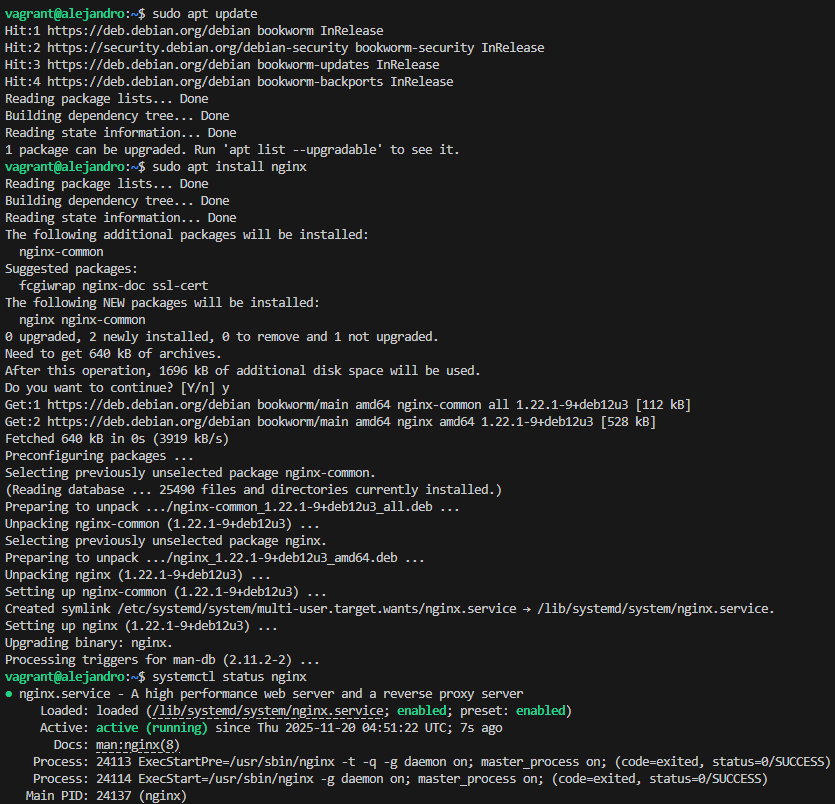

## Creación de las carpetas del sitio web

Igual que ocurre en Apache, todos los archivos que formarán parte de un sitio web que servirá nginx se organizarán en carpetas. Estas carpetas, típicamente están dentro de /var/www.

Vamos a crear la carpeta de nuestro sitio web o dominio, y dentro de esa carpeta clonaremos un repositorio:

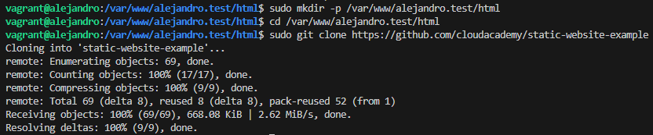

Una vez hecho esto, haremos que el propietario de la carpeta y todo su contenido sea "www-data", y le daremos los permisos adecuados para que no nos de un error al entrar en el sitio web:

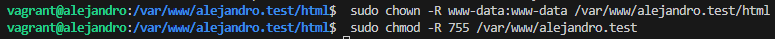

Ahora comprobaremos que el servidor está funcionando y sirviendo páginas correctamente accediendo desde el cliente mediante la IP de nuestra máquina:

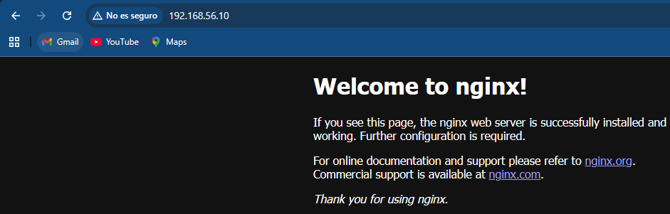

## Configuración de servidor web NGINX

En Nginx hay dos rutas importantes. La primera de ellas es "sites-available", que contiene los archivos de configuración de los hosts virtuales o bloques disponibles en el servidor. Es decir, cada uno de los sitios webs que alberga el servidor. La otra es "sites-enabled", que contiene los archivos de configuración de los sitios habilitados, es decir, los que funcionan en ese momento.

Dentro de "sites-available" hay un archivo de configuración por defecto, que es la página que se muestra si accedemos al servidor sin indicar ningún sitio web o cuando el sitio web no es encontrado en el servidor (debido a una mala configuración por ejemplo). Esta es la página que nos ha aparecido en el apartado anterior.

Para que Nginx presente el contenido de nuestra web, es necesario crear un bloque de servidor con las directivas correctas. En vez de modificar el archivo de configuración predeterminado directamente, crearemos uno nuevo con el siguiente código.

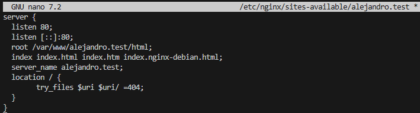

Aquí la directiva root debe ir seguida de la ruta absoluta dónde se encuentre el archivo "index.html" de nuestra página web, que se encuentra entre todos los que habéis descomprimido.

Y crearemos un archivo simbólico entre este archivo y el de sitios que están habilitados, para que se dé de alta automáticamente.

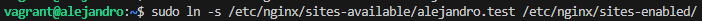

Para aplicar la configuración tendremos que reiniciar el servidor nginx:

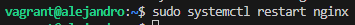

### Comprobaciones

Si no poseemos un servidor DNS que traduzca los nombres a IPs, debemos hacerlo de forma manual. Se puede realizar de dos maneras:
• Editando el archivo hosts de nuestra máquina anfitriona
• Usando un servicio como nip.io o xip.io que hacen la traducción automáticamente.

En mi caso lo voy a hacer de la primera forma, vamos a editar el archivo "/etc/hosts" de nuestra máquina anfitriona para que asocie la IP de la máquina virtual, a nuestro "server_name". Este archivo, en Linux, está en /etc/hosts y en Windows: C:\Windows\System32\drivers\etc\hosts. Y deberemos añadirle la siguiente línea al archivo:

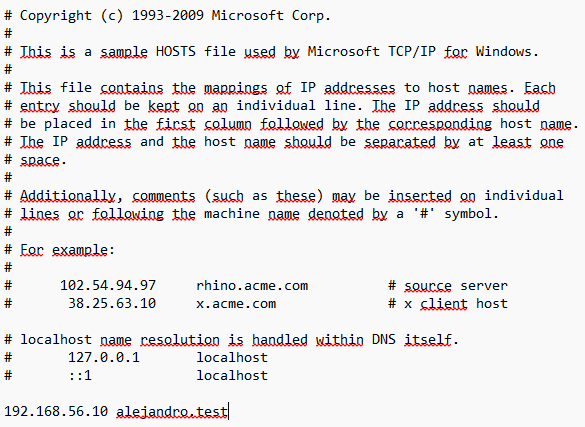

Cada uno pondrá la IP de su máquina virtual.

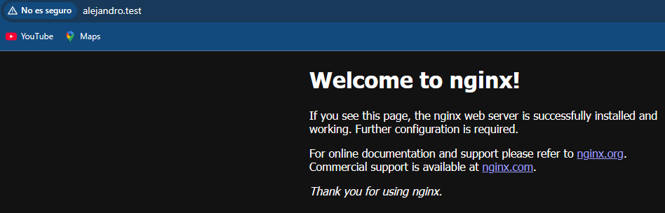

Comprobaremos que las peticiones se están registrando correctamente en los archivos de logs, tanto las correctas como las erróneas:

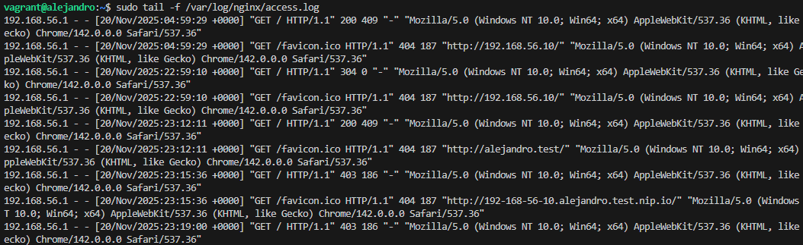

Cada solicitud a su servidor web se registra en este archivo de registro, a menos que Nginx esté configurado para hacer algo diferente.

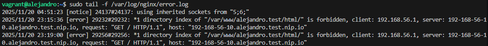

Cualquier error de Nginx se asentará en este registro.

## Instalación de Docker

Primero vamos a comprobar que tenemos instalado Docker en el sistema:

**docker --version**

Si no lo tenemos instalado, lo podremos instalar de la siguiente manera:

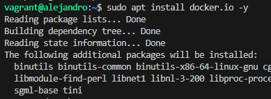

## Creación de la estructura de carpetas del sitio web

En la máquina anfitriona vamos a crear la estructura de carpetas que contendrá los archivos del sitio web y la configuración de Nginx y dentro de la carpeta "html" vamos a clonar un repositorio:

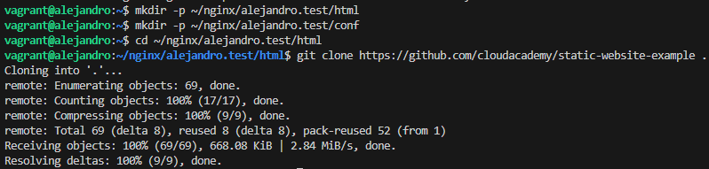

## Configuración de servidor web NGINX con Docker

Creamos un archivo de configuración de Nginx en la máquina anfitriona con el siguiente contenido:

**nano ~/nginx/example.test/conf/nginx.conf**

Ahora crearemos un contenedor Docker que ejecute Nginx. Este contenedor montará los archivos del sitio web desde la máquina anfitriona. Además comprobaremos que el contenedor se está ejecutando y veremos sus logs.

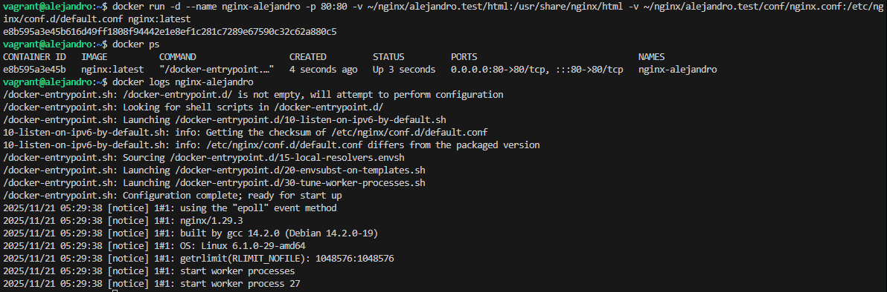

## Comprobación del funcionamiento

Para comprobar que el servidor está funcionando y sirviendo páginas correctamente, accederemos desde el cliente:

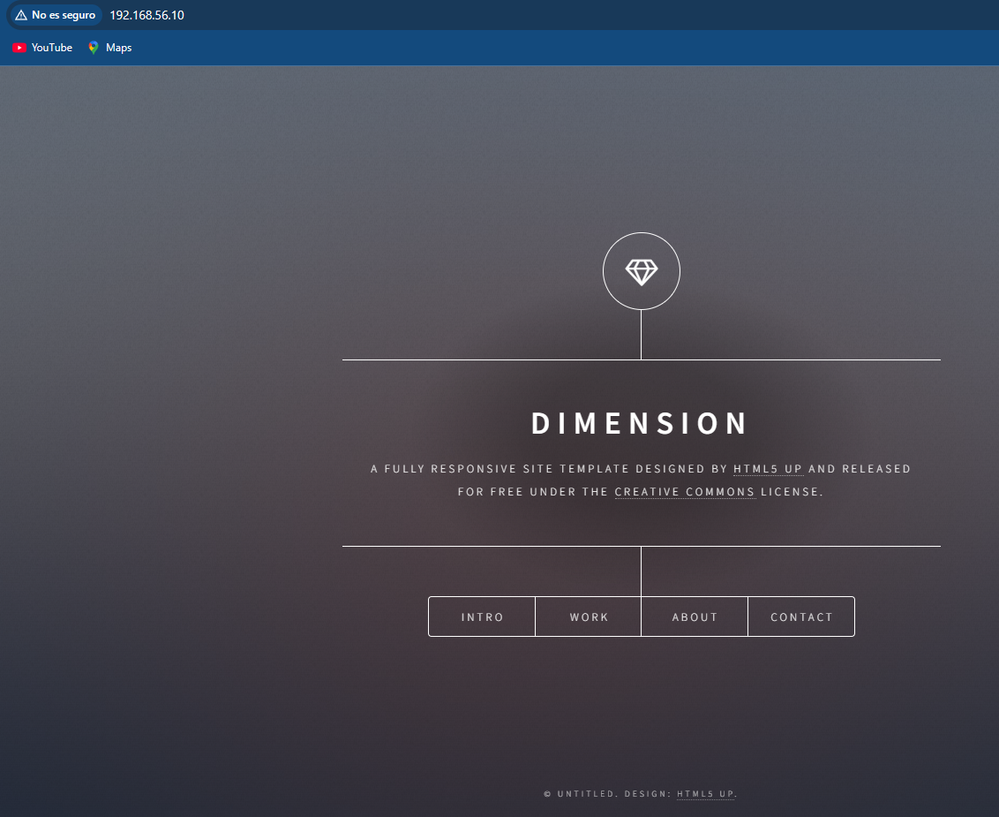

Si queremos usar un nombre de dominio, podemos utilizar uno de los métodos vistos anteriormente.

En mi caso voy a volver a utilizar el mismo método.

Vamos a editar el archivo "/etc/hosts" de nuestra máquina anfitriona para que asocie la IP local 127.0.0.1 (o la IP de la máquina host si accedéis desde otro equipo) a nuestro nombre de dominio. Este archivo, en Linux, está en "/etc/hosts" y en Windows: C:\Windows\System32\drivers\etc\hosts. Y deberemos añadirle la línea:

Podemos ver los logs del contenedor usando Docker:

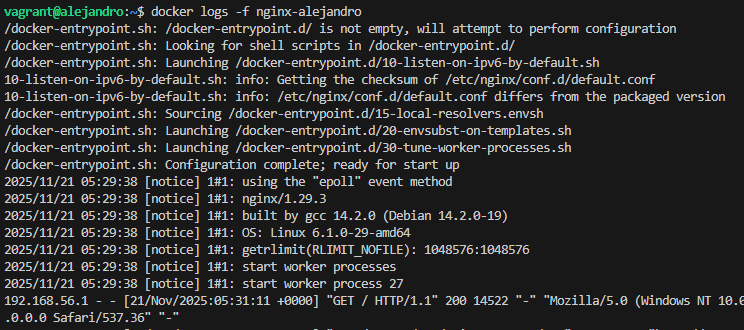

También podemos acceder a los logs dentro del contenedor:

**docker exec nginx-example cat /var/log/nginx/access.log**

Cada solicitud a su servidor web se registra en este archivo de registro, a menos que Nginx esté configurado para hacer algo diferente.

**docker exec nginx-example cat /var/log/nginx/error.log**

Cualquier error de Nginx se asentará en este registro.

## Gestión del contenedor

Podemos detener el contenedor o reiniciarlo:

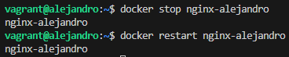

Si necesitamos cambiar la configuración de Nginx, editamos el archivo "~/nginx/example.test/conf/nginx.conf" en la máquina anfitriona y luego reiniciamos el contenedor.

Si no necesitamos el contenedor y queremos borrarlo:

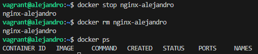

## Usando docker-compose

Si queremos una configuración más robusta y fácil de reproducir, podemos crear un archivo "docker-compose.yml" con el siguiente contenido:

**nano ~/nginx/example.test/docker-compose.yml**

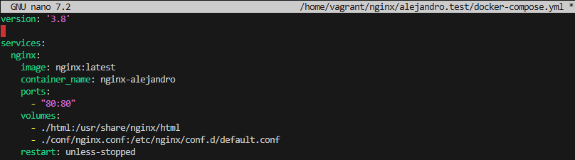

Para ejecutar el contenedor con docker-compose:

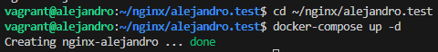

Para ver los logs:

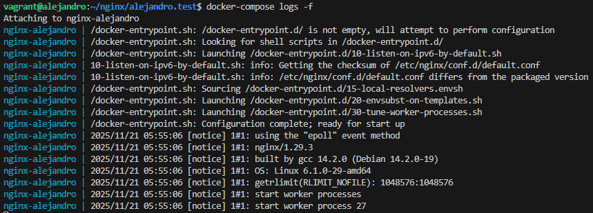

Para detener los contenedores:

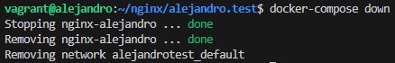

# Documentación práctica NGINX II: Autenticación en Nginx

## Paquetes necesarios

En primer lugar debemos comprobar si el paquete está instalado, y en caso de no estarlo debemos instalarlo:

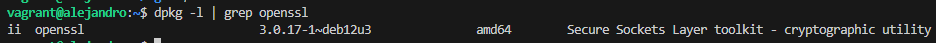

## Creación de usuarios y contraseñas para el acceso web

Crearemos un archivo oculto llamado .htpasswd en el directorio de configuración /etc/nginx donde
guardar nuestros usuarios y contraseñas. Crearemos un pasword cifrado para el usuario de forma interactiva o interactiva.

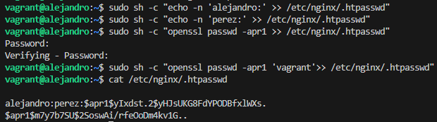

## Configurando el servidor Nginx para usar autenticación básica

Editaremos la configuración del server block sobre el cual queremos aplicar la restricción de acceso. Utilizaremos para esta autenticación el sitio web de Perfect Learn:

Debemos decidir qué recursos estarán protegidos. Nginx permite añadir restricciones a nivel de servidor o en un location (directorio o archivo) específico. Para nuestro ejemplo, vamos a proteger el document root (la raíz, la página principal) de nuestro sitio.

Utilizaremos la directiva auth_basic dentro del location y le pondremos el nombre a nuestro dominio que será mostrado al usuario al solicitar las credenciales. Por último, configuramos Nginx para que utilice el fichero que previamente hemos creado con la directiva auth_basic_user_file.

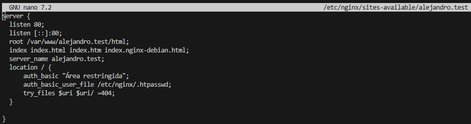

Una vez terminada la configuración, reiniciamos el servicio para que aplique nuestra política de acceso.

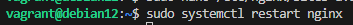

## Probando la nueva configuración

Comprobamos desde la máquina física/anfitrión que podemos acceder a http://nombre-sitio-web y que se solicita autenticación.

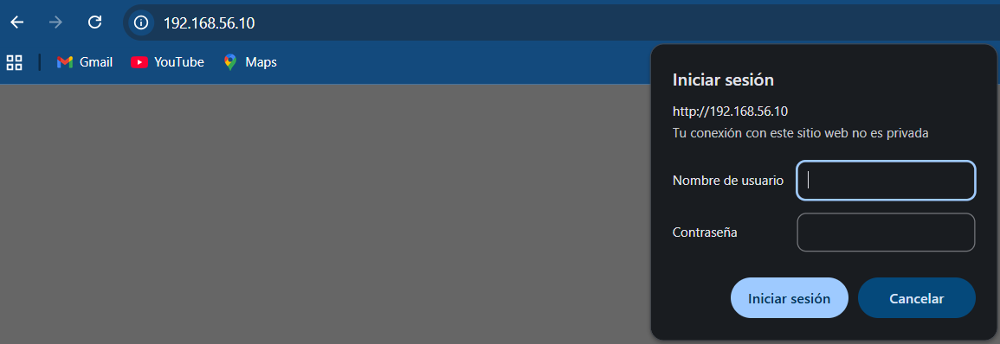

Comprobamos que si cancelamos la autenticación, se negará el acceso al sitio con un error. Un error 401 que nos indica que necesitamos ser autorizados.

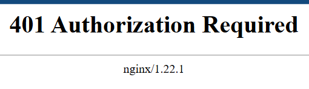

## Tareas

Intentamos entrar primero con un usuario erróneo y luego con otro correcto. Podemos ver todos los sucesos y registros en los logs access.log y error.log.

**Usuario erróneo:**

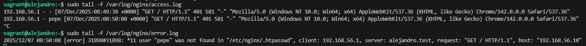

**Usuario correcto:**

La autenticación se aplica al directorio/archivo que le indicamos en la declaración del location y que en este caso el raíz /.

Así pues, esta restricción se aplica al directorio raíz o base donde residen los archivos del sitio web y que es /var/www/example.test/html/static-website-example en nuestro caso. Y a todos los archivos que hay dentro, ya que no hemos especificado ninguno en concreto.

Vamos a intentar que sólo se necesite autenticacíón para entrar a la parte de portfolio. Esta sección se corresponde con el archivo contact.html dentro del directorio raíz.

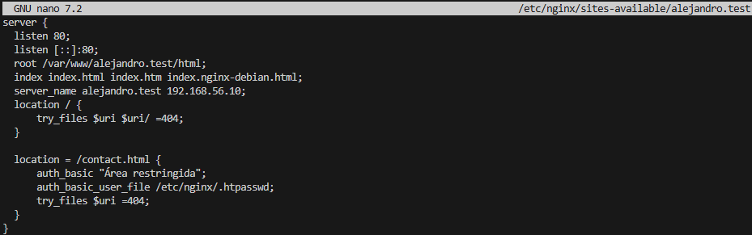

## Combinación de la autenticación básica con la restricción de acceso por IP

La autenticación básica HTTP puede ser combinada de forma efectiva con la restricción de acceso por dirección IP. Se pueden implementar dos escenario:

• Un usuario debe estar ambas cosas, autenticado y tener una IP válida

• Un usuario debe o bien estar autenticado, o bien tener una IP válida

Dentro del block server o archivo de configuración del dominio web, que recordad está en el directorio sites-available.

## Tareas

Configuramos Nginx para que no deje acceder con la IP de la máquina anfitriona al directorio raíz de una de las dos webs. Modificamos su server block o archivo de configuración. Comprobamos como se deniega el acceso:

• Mostraremos la página de error en el navegador

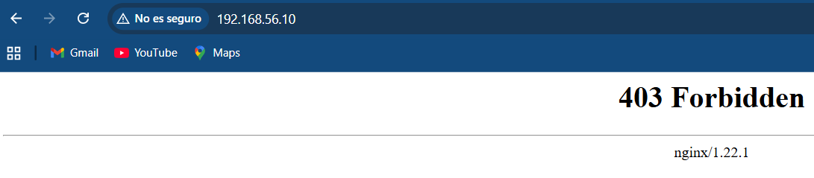

• Mostraremos el mensaje de error de error.log

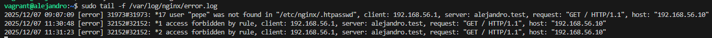

Configuramos Nginx para que desde la máquina anfitriona se tenga que tener tanto una IP válida como un usuario válido, ambas cosas a la vez, y comprueba que sí puede acceder sin problemas

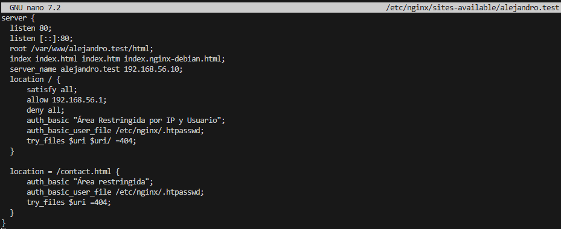

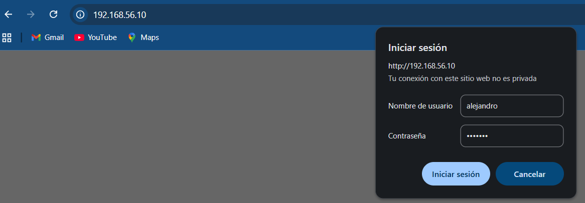

# Documentación práctica NGINX II: Autenticación en Nginx con Docker

En el contexto de una transacción HTTP, la autenticación de acceso básica es un método diseñado para permitir a un navegador web, u otro programa cliente, proveer credenciales en la forma de usuario y contraseña cuando se le solicita una página al servidor.

La autenticación básica, como su nombre lo indica, es la forma más básica de autenticación disponible para las aplicaciones Web. Fue definida por primera vez en la especificación HTTP en sí y no es de ninguna manera elegante, pero cumple su función.

Este tipo de autenticación es el tipo más simple disponible pero adolece de importantes problemas de seguridad que no la hacen recomendable en muchas situaciones. No requiere el uso ni de cookies, ni de identificadores de sesión, ni de página de ingreso.

## Paquetes necesarios

Para esta práctica utilizaremos utilidades de OpenSSL, que ya están disponibles en el contenedor de
stakater/ssl-certs-generator. En tu máquina anfitriona, descarga:

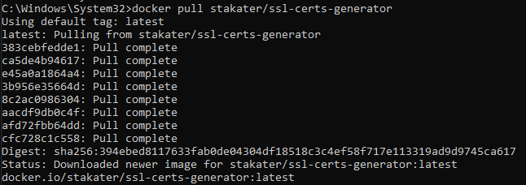

## Creación de usuarios y contraseñas para el acceso web

Crearemos un archivo llamado htpasswd en tu máquina anfitriona dentro de la estructura de configuración de tu sitio web:

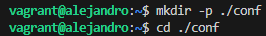

Edita el fichero htpasswd y añade en la primera línea

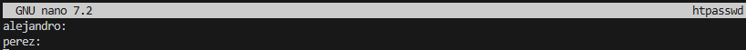

Ahora crearemos un password cifrado para el usuario de forma no interactiva con nuestra imagen:

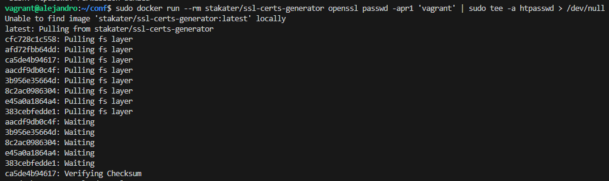

Y tendremos algo parecido a esto (ajusta el fichero si no te queda igual):

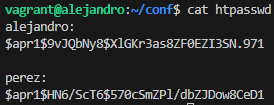

## Configurando el contenedor Nginx para usar autenticación básica

Editaremos el archivo de configuración de Nginx. Si no tuviesemos uno hecho, sacaremos de la imagen el fichero de configuración para editarlo con el siguiente comando:

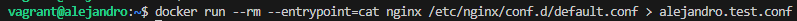

Editaremos el fichero conf/alejandro.test.conf

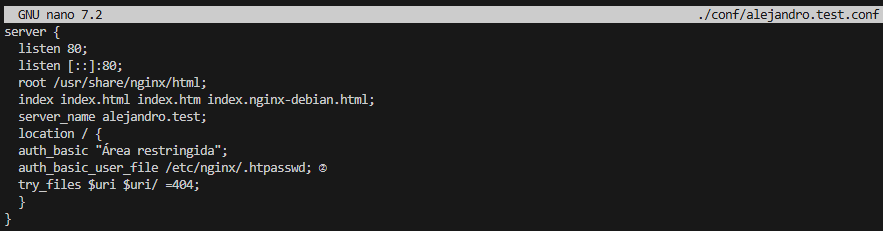

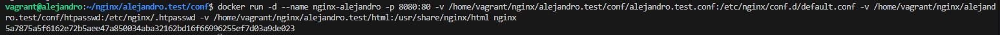

## Probando la nueva configuración

Comprobamos desde la máquina física/anfitrión que podemos acceder a http://nombre-sitio-web y que se solicita autenticación.

Comprobamos que si cancelamos la autenticación, se negará el acceso al sitio con un error. Un error 401 que nos indica que necesitamos ser autorizados.

## Tareas

Intentamos entrar primero con un usuario erróneo y luego con otro correcto. Podemos ver todos los sucesos y registros en los logs access.log y error.log.

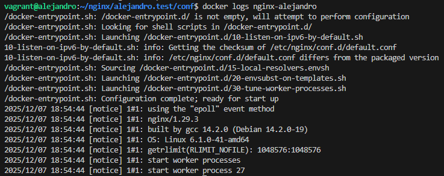

**Usuario erróneo:**

**Usuario correcto:**

La autenticación se aplica al directorio/archivo que le indicamos en la declaración del location y que en este caso el raíz /.

Así pues, esta restricción se aplica al directorio raíz o base donde residen los archivos del sitio web y que es /var/www/example.test/html/static-website-example en nuestro caso. Y a todos los archivos que hay dentro, ya que no hemos especificado ninguno en concreto.

Vamos a intentar que sólo se necesite autenticacíón para entrar a la parte de portfolio. Esta sección se corresponde con el archivo contact.html dentro del directorio raíz.

## Combinación de la autenticación básica con la restricción de acceso por IP

La autenticación básica HTTP puede ser combinada de forma efectiva con la restricción de acceso por dirección IP. Se pueden implementar dos escenario:

• Un usuario debe estar ambas cosas, autenticado y tener una IP válida

• Un usuario debe o bien estar autenticado, o bien tener una IP válida

Dentro del block server o archivo de configuración del dominio web, que recordad está en el directorio sites-available.

## Tareas

Configuramos Nginx para que no deje acceder con la IP de la máquina anfitriona al directorio raíz de una de las dos webs. Modificamos su server block o archivo de configuración. Comprobamos como se deniega el acceso:

• Mostraremos la página de error en el navegador

• Mostraremos el mensaje de error de error.log

Configuramos Nginx para que desde la máquina anfitriona se tenga que tener tanto una IP válida como un usuario válido, ambas cosas a la vez, y comprueba que sí puede acceder sin problemas

